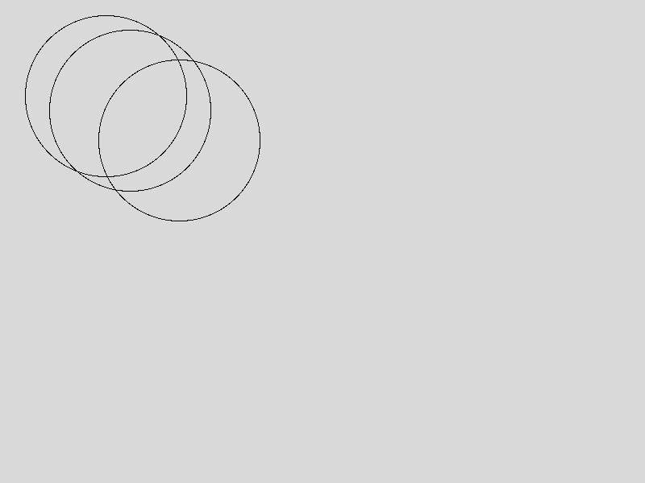

# paralax-demo

This program makes use of a webcam feed through [OpenCV for Python](https://opencv.org) to determine the user's location relative to the computer, and draw three circles (with varying weights) to visually demonstrate how an X,Y coordinate can be used to make a simple paralax effect. This can be further modified as the basis for a full game. (Think looking around corners in a semi-3D game like [My Friend Pedro](https://store.steampowered.com/app/557340/My_Friend_Pedro/))